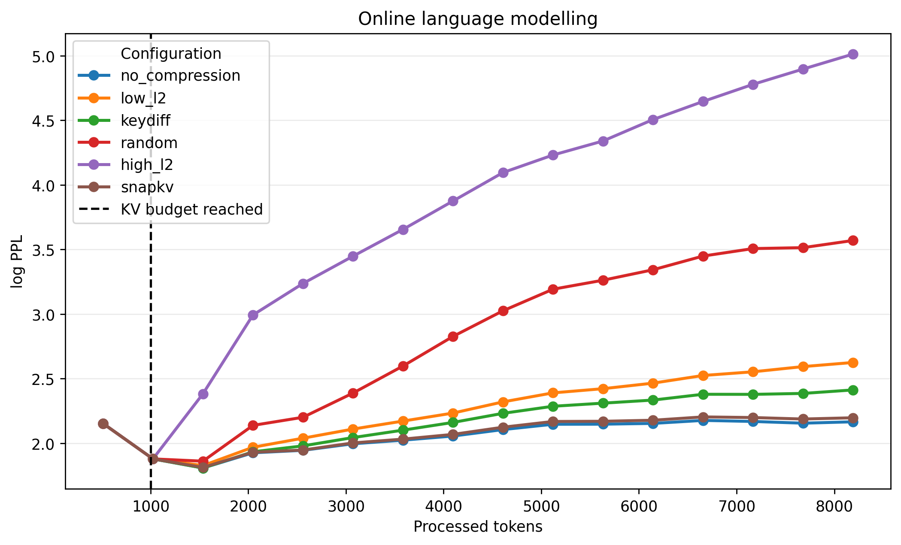
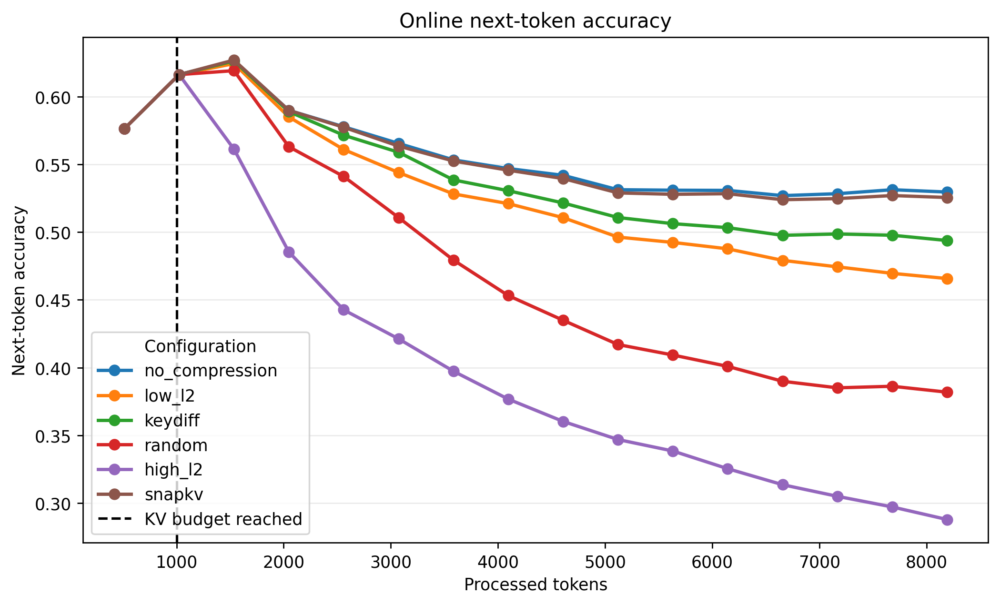

# KV Cache Compression Benchmark

This repository studies KV-cache compression for long-context inference with
`Qwen/Qwen2.5-3B-Instruct`. It implements several token-eviction strategies
while leaving the language model unchanged, with an emphasis on reproducible
experiments that fit university and Kaggle hardware.

The project evaluates whether compressed caches preserve information in
passkey retrieval and how they affect perplexity, next-token accuracy, and
memory use during online language modelling on WikiText-2.

## Methods

### L2Compress

Following Devoto et al., L2Compress scores cached keys by their L2 norm and
retains low-L2 keys, which are treated as more important. The method does not
require attention scores.

### KeyDiff

KeyDiff, proposed by Park et al., measures redundancy through cosine similarity
to an anchor computed from the cached keys. Keys that are less similar to the
anchor are treated as more distinctive and retained. This implementation
focuses on the KeyDiff eviction criterion rather than a full reproduction of
the paper's block-wise inference protocol.

### SnapKV

SnapKV, introduced by Li et al., uses attention from an observation window at
the end of the prompt to select important KV positions per attention head. It
provides an attention-based comparison with the attention-free L2Compress and
KeyDiff criteria.

Random selection and high-L2 selection are included as control and ablation
baselines.

## Benchmarks

Experiments use `Qwen/Qwen2.5-3B-Instruct` to provide a reproducible reduced
benchmark that can run on limited university or Kaggle hardware.

### Passkey retrieval

A numeric passkey is inserted into a long prompt and retrieved after prefill.
The KV cache is compressed before generation, and correctness is measured by
exact token matching. L2Compress, KeyDiff, and SnapKV are supported; keep
ratios, absolute cache targets, and skipped layers can be selected from the
command line.

### Online language modelling

A deterministic 8,192-token WikiText-2 stream is processed in 32-token causal
blocks. Once the selected budget is exceeded, each eviction strategy keeps the
physical cache bounded. The benchmark records cumulative log-perplexity and
perplexity, next-token accuracy, and KV-cache memory use. The shared cache
budget is configurable, for example to 1,000 or 2,000 tokens.

## Results

### Passkey retrieval

The notebook contains persisted results for 16,384-token prompts and seeds
0, 1, and 2:

| Method | KV setting | Accuracy | Memory saved |
| --- | --- | ---: | ---: |
| No compression | Full 16,384-token cache | 100% | 0% |
| L2Compress | 10% keep; layers 0–1 uncompressed | 100% | 85.00% |
| KeyDiff | 10% keep; all layers compressed | 100% | 90.00% |
| SnapKV | 1,024-token target; all layers compressed | 100% | 93.75% |

These runs use different physical cache settings, so the table summarizes the
persisted experiments rather than presenting a strictly matched comparison.

### Online language modelling

The tracked 1k experiment uses Qwen2.5-3B-Instruct, 8,192 processed tokens, a
1,000-token cache budget, and no skipped layers. Every compressed method uses
the same absolute budget.





Final metrics from `results/online_lm_summary_1k.csv` are:

| Method | Perplexity | Next-token accuracy |
| --- | ---: | ---: |
| No compression | 8.726 | 52.95% |
| L2Compress | 13.808 | 46.57% |
| KeyDiff | 11.166 | 49.38% |
| Random | 35.494 | 38.18% |
| High-L2 | 150.176 | 28.78% |
| SnapKV | 9.002 | 52.55% |

In this reduced Qwen2.5-3B benchmark, SnapKV stays closest to the uncompressed
baseline. KeyDiff performs better than low-L2 at the same 1,000-token budget,
while random and high-L2 selection degrade more substantially.

## Quick start

Install the pinned environment and the local package:

```bash
pip install -r requirements-kaggle.txt
pip install -e . --no-deps
```

Run a representative passkey experiment:

```bash
python scripts/run_keydiff_passkey.py \
  --context-lengths 8192 \
  --seeds 0 1 2 \
  --keep-ratio 0.10
```

Passkey runners compress every layer by default; add skipped layers only when
the experiment requires them.

Run online language modelling with a 1,000-token cache budget:

```bash
python scripts/run_online_lm.py --max-cache-tokens 1000
```

Plot the resulting cumulative metrics:

```bash
python scripts/plot_online_lm.py \
  --input-csv results/online_lm_curve.csv \
  --output results/online_lm_log_ppl.png \
  --accuracy-output results/online_lm_accuracy.png
```

Use each script's `--help` output for the complete CLI. `evaluation.ipynb`
provides the Kaggle/notebook workflow used to reproduce the experiments.

## Project structure

- `src/l2kv/` — compression implementations and evaluation utilities
- `scripts/` — benchmark and plotting entry points
- `results/` — saved benchmark outputs and plots
- `evaluation.ipynb` — Kaggle experiment workflow
- `tests/` — regression and algorithm tests

Implementation details and limitations are documented in
[`docs/IMPLEMENTATION_NOTES.md`](docs/IMPLEMENTATION_NOTES.md) and
[`docs/SNAPKV_NOTES.md`](docs/SNAPKV_NOTES.md).

## References

- Devoto et al., [*A Simple and Effective L2 Norm-Based Strategy for KV Cache Compression*](https://arxiv.org/abs/2406.11430), arXiv:2406.11430.
- Park et al., [*KEYDIFF: Key Similarity-Based KV Cache Eviction for Long-Context LLM Inference in Resource-Constrained Environments*](https://arxiv.org/abs/2504.15364), arXiv:2504.15364.
- Li et al., [*SnapKV: LLM Knows What You are Looking for Before Generation*](https://arxiv.org/abs/2404.14469), arXiv:2404.14469.
